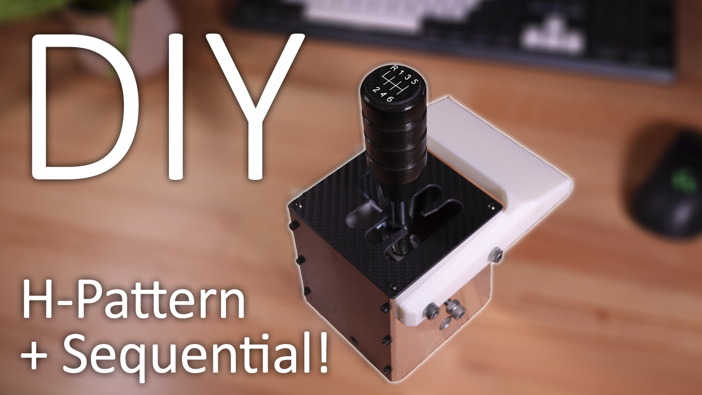

# H-Pattern and Sequential Shifter

Link to the video: [https://youtu.be/RtLBD2DWTTg](https://youtu.be/AKZnvJ_tqVI)

I got sick of using the flappy paddles on my Logitech wheel so I decided to build my own H-Pattern and sequential shifter! All parts can be 3D printed!

I've included all the files in both STEP and STL format. If you decide to have the internals made in Aluminium like I did in the video, use the "Bearing Mount Alloy.STEP" file instead of the "Printed Bearing Block.STL".

You will also need to purchase the following parts:

2x 625 Bearings - https://www.aliexpress.com/item/1005004857666772.html

2x R4 Bearings - https://www.aliexpress.com/item/32929910901.html

4x 623 Bearings - https://www.aliexpress.com/item/1005004857666772.html

1x 10k 16mm Linear Potentiometer - https://www.aliexpress.com/item/1005006600576995.html

2x Micro Lever Switches (Handle 11.5mm) - https://www.aliexpress.com/item/1005005596552328.html

5mm Steel Ball - https://www.aliexpress.com/item/1005005656499702.html

4mm OD Spring - https://www.aliexpress.com/item/1005005402716572.html

13x30x1.4 Spring - https://www.aliexpress.com/item/1005006145869116.html

10x30x1 Extension Spring - https://www.aliexpress.com/item/1005006138122733.html

1x Arduino Pro Micro - https://www.aliexpress.com/item/1005006654641959.html

1x 10x140mm Hardened Steel Shaft - https://www.aliexpress.com/item/1005007573838689.html

If printing, you will also need:
16x M3x5x5 Threaded Inserts
2x M3x4x5 Threaded Inserts

You'll also need a variety of M3 screws, nuts and washers along with a couple of M5 washers for spacing out the bearings as shown in the video.

#### Electronics and Software

Wire the potentiometer output to A3, and the switches to D2 and D3.

When you first flash the code to your Arduino, change the debug variable to true and check the serial port for readings from your potentiometer. Copy values from each gate into the correct variables and then re-upload the code and verify the correct gears are being selected. Then change debug back to false and re-upload!
